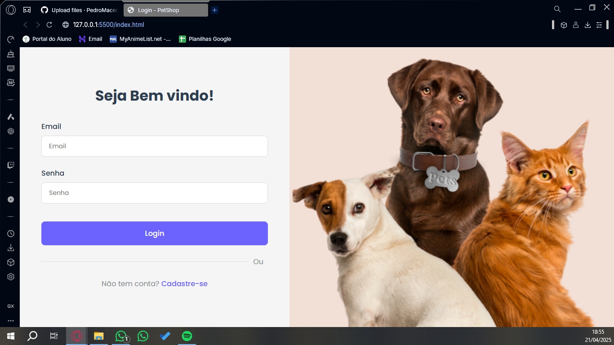

  # 🐾 PetShop Agendamento - Sistema de Gerenciamento
  Sistema completo de agendamento para petshops desenvolvido como projeto acadêmico.

  

---

## ✨ Funcionalidades Principais

- 📝 Cadastro e autenticação de usuários  
- 🗓️ Agendamento com upload de foto do pet  
- 🔍 Visualização de agendamentos em cards  
- ⚙️ Edição e exclusão de agendamentos  
- 📱 Design responsivo para todos os dispositivos  

---

## 📁 Projeto-PetShop

├── 📄 index.html              → Página de login  
├── 📄 cadastro.html           → Página de cadastro de usuários  
├── 📄 agendamento.html        → Página para criar e editar agendamentos  
├── 📄 meus-agendamentos.html → Página com a lista de agendamentos realizados  
├── 📄 script.js               → Arquivo com a lógica principal do sistema  
├── 🎨 styles.css              → Estilos globais da aplicação  
├── 🎨 meus-agendamentos.css   → Estilos específicos para a página de agendamentos  
├── 🖼️ pets.png                → Imagem de fundo utilizada nas páginas

---

## 🖥️ Como Usar (Versão LocalStorage)

### 🔓 1. Tela de Login
📄 `index.html`  
- Insira seu **email** e **senha**
- Clique em **Login** para acessar o sistema

---

### 🆕 2. Cadastro de Usuários
📄 `cadastro.html`  
- Acesse a página de cadastro
- Preencha **todos os campos obrigatórios**
- Clique em **Cadastrar** para criar sua conta

---

### 📅 3. Criar Agendamento
📄 `agendamentos.html`  
- Preencha os dados do **pet** e do **serviço desejado**
- Faça o **upload de uma foto** (opcional)
- Clique em **Agendar**

---

### 📋 4. Gerenciar Agendamentos
📄 `meus-agendamentos.html`  
- Visualize todos os seus agendamentos
- **Edite ou exclua** com facilidade
- Use o campo de **filtro por data** para encontrar agendamentos rapidamente

---

## 👨‍💻 Desenvolvedor

**Pedro Augusto da Silva Macedo**  
RA: 21010681  
Disciplina: *Desenvolvimento Web Full Stack*  
Instituição: *Fundação Escola de Comércio Álvares Penteado*
